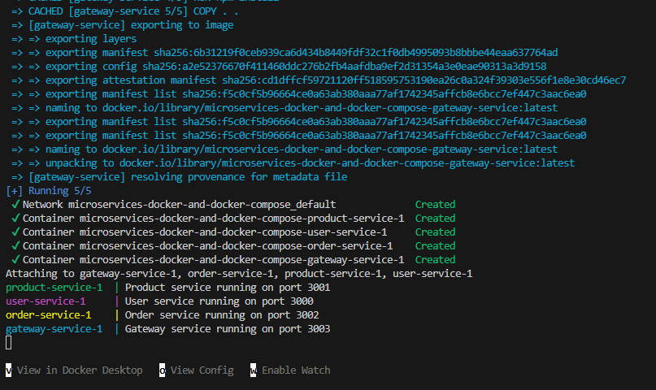
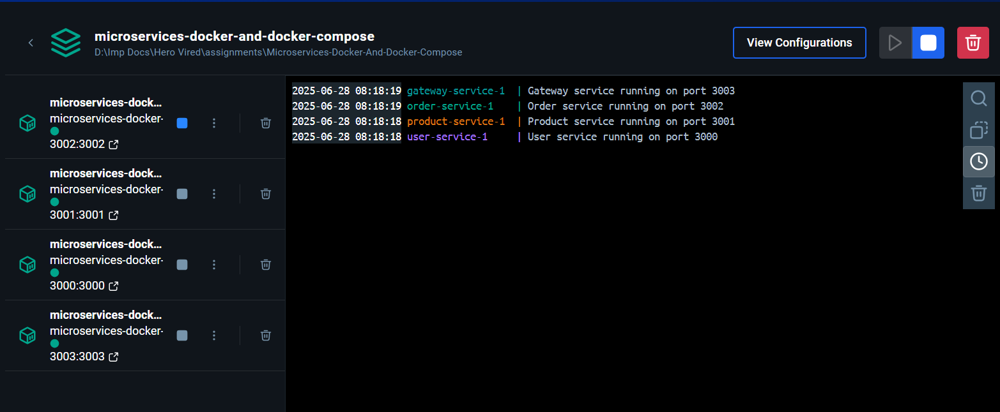
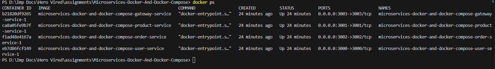
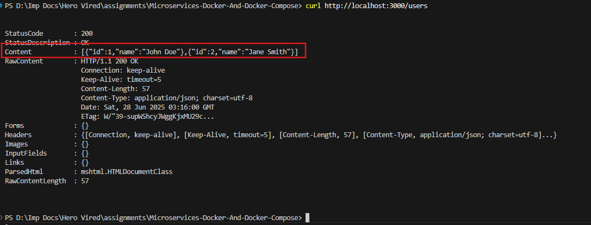
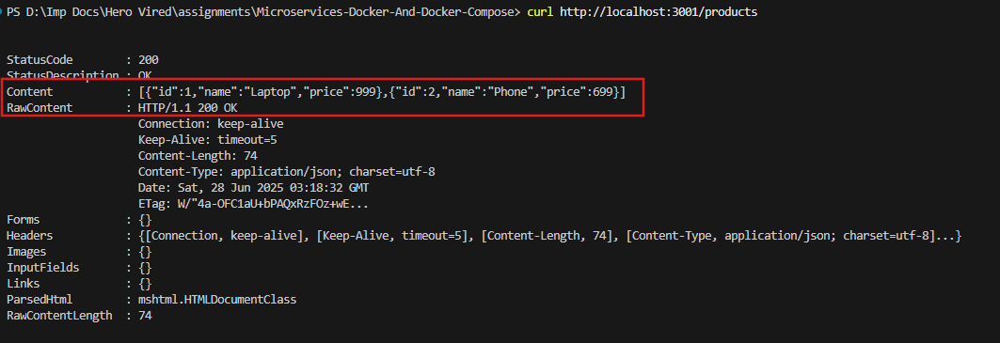
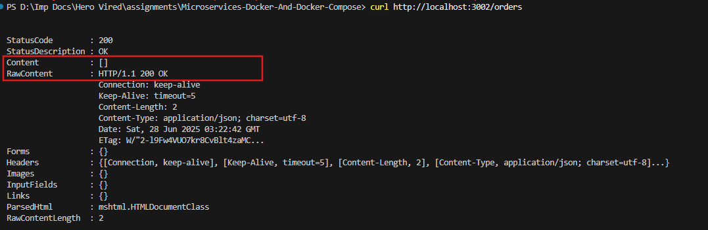
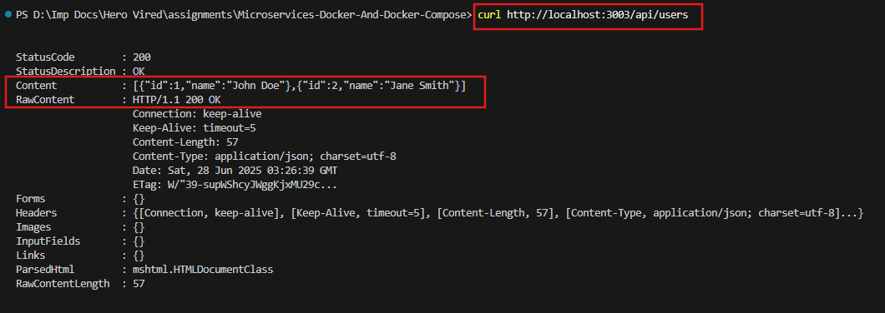
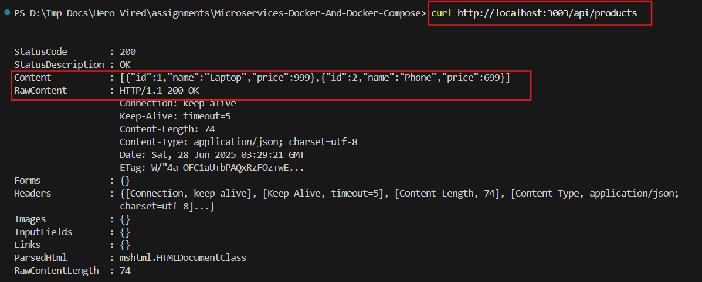
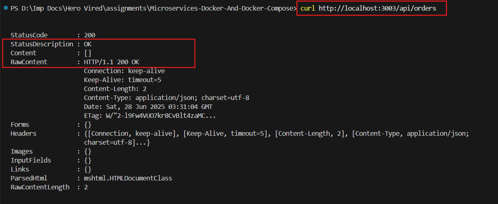

# 🐳 Microservices Containerization – Hero Vired Assignment

## 📘 Objective

Containerize a microservices-based Node.js application using Docker and orchestrate it using Docker Compose.

---

## 🛠️ Tech Stack

- **Node.js**
- **Docker**
- **Docker Compose**
- **`curl` for API Testing**

---

## 📂 Microservices Overview

| Service Name     | Port   | Description                            |
|------------------|--------|----------------------------------------|
| User Service     | 3000   | Returns user data                      |
| Product Service  | 3001   | Returns product list                   |
| Order Service    | 3002   | Returns order details                  |
| Gateway Service  | 3003   | Aggregates all other services via `/api` |

---

## 🔨 Setup Instructions

### ✅ 1. Clone the Repository
```bash
git clone https://github.com/kushal1997/Microservices-Docker-And-Docker-Compose.git
cd Microservices-Docker-And-Docker-Compose
```
### ✅ 2. Run Docker Compose
```
docker-compose up
```

📸 **Screenshot**: *Docker-compse output*
<p align="center">
  
</p>

<br>

📸 **Screenshot**: *Docker desktop container view*
<p align="center">
  
</p>

docker_ps
### ✅ 3. Verify Containers Are Running
```
docker ps
```
📸 **Screenshot**: *`docker ps` in cmd*
<p align="center">
  
</p>

### ✅ 4. API Endponints Testing
- User-Service
```
curl http://localhost:3000/users
```

📸 **Screenshot**: *User Service API*
<p align="center">
  
</p>

<br>

- Product Service
```
curl http://localhost:3001/products
```
📸 **Screenshot**: *Product Service API*
<p align="center">
  
</p>

<br>

- Order Service
```
curl http://localhost:3002/orders
```
📸 **Screenshot**: *Order Service API*
<p align="center">
  
</p>


<br>

- Gateway Service

  - api/users

      ```
      curl http://localhost:3003/api/users
      ```
      📸 **Screenshot**: *Gateway Service - User API*
      <p align="center">
        
      </p>

      <br>

  - api/products

      ```
      curl http://localhost:3003/api/products
      ```
      📸 **Screenshot**: *Gateway Service - Product API*
      <p align="center">
        
      </p>

      <br>
  
  - api/orders

      ```
      curl http://localhost:3003/api/orders
      ```
      📸 **Screenshot**: *Gateway Service - Order API*
      <p align="center">
        
      </p>

      <br>
      
---

## 👤 Author

- **U KUSHAL RAO**
- GitHub: [@kushal1997](https://github.com/kushal1997)

---

## 🚀 How to Reproduce This
1. Clone the repo
2. Run `docker-compose up`
3. Access each service through localhost ports
4. Use browser, curl, or Postman to validate API responses


